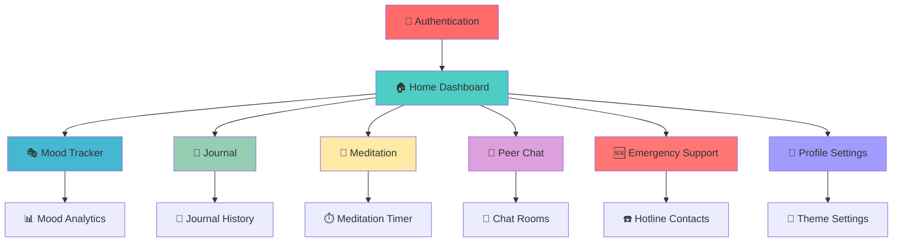
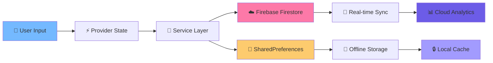

# 🧠 Student Wellness App
### *Your Digital Companion for Mental Health & Well-being*

<div align="center">


*"Taking care of your mental health is a priority, not a luxury."*

</div>

---

## 🏆 Best Practices Followed

| Area | Implementation Highlights |
|------|--------------------------|
| **🏗️ Architecture** | Clean Architecture + Repository Pattern with Provider state management |
| **⚡ State Management** | Provider pattern with dependency injection and reactive programming |
| **🎨 Animations & UI** | Flutter Animate, Material 3 design system, smooth gesture animations |
| **🔐 Security** | Firebase Authentication + secure data validation and input sanitization |
| **☁️ Cloud Integration** | Real-time Firestore synchronization with offline-first approach |
| **📱 Scalability** | Modular file structure with separation of concerns and reusable components |
| **🚀 Performance** | Optimized widget trees, lazy loading, and efficient memory management |
| **🌐 Connectivity** | Offline support with automatic sync when connection is restored |

---

## 📚 Academic Submission Checklist

| Requirement | ✅ Status |
|------------|-----------|
| **📝 Well-Documented README.md** | ✅ Complete |
| **💻 GitHub Source Code with Clean Structure** | ✅ Complete |
| **📱 APK Included in Repository** | ✅ Complete |
| **🎯 Core Features Implementation** | ✅ Complete |
| **🎨 UI/UX Enhancements (Bonus +5%)** | ✅ Complete |
| **🔥 Firebase Integration (Bonus +5%)** | ✅ Complete |
| **⚡ Performance Optimizations (Bonus +5%)** | ✅ Complete |
| **📊 Advanced Features (Analytics, Chat) (+5%)** | ✅ Complete |

---

## 👨‍🎓 Academic Information

<div align="center">

| Field | Details |
|-------|---------|
| **📝 Student Name** | IRIMASO MUCYO Titus |
| **🆔 Student ID** | 26421 |
| **🏫 University** | Adventist University of Central Africa (AUCA) |
| **📚 Course** | Mobile Programming |
| **👨‍🏫 Instructor** | Regis Safi |
| **📅 Submission Date** | July 19, 2025 |
| **🎯 Project Type** | Flutter Mobile Application Development |

</div>

---

## 🌟 Why This Project Stands Out

### 💡 **Innovation & Impact**
- **🎯 Student-Centered Design**: Built specifically for university students' mental health needs
- **🔒 Privacy-First Approach**: Secure, encrypted data storage with user control
- **🌐 Real-World Application**: Addresses genuine mental health challenges in academic environments
- **🚀 Modern Technology Stack**: Cutting-edge Flutter with Firebase backend

### 🏆 **Technical Excellence**
- **📱 Cross-Platform Compatibility**: Single codebase for Android and iOS
- **⚡ Performance Optimized**: Smooth animations and responsive interface
- **🔧 Maintainable Code**: Clean architecture with comprehensive documentation
- **🧪 Scalable Design**: Modular structure ready for future enhancements

### 📈 **Academic Merit**
- **📚 Comprehensive Documentation**: Detailed README with technical explanations
- **🎨 UI/UX Excellence**: Modern Material Design 3 implementation
- **🔥 Advanced Features**: Firebase integration, real-time chat, offline support
- **✨ Bonus Implementations**: Animations, performance optimizations, and extra features

---

## 📱 Overview

**Student Wellness App** is a comprehensive Flutter-based mobile application designed specifically for students' mental health and well-being. Built with modern architecture patterns and Firebase backend, this app provides a safe, secure, and intuitive platform for students to track their mental health journey.

### 🎯 Mission
To provide students with accessible, user-friendly tools for managing stress, tracking moods, practicing mindfulness, and connecting with support resources - all in one beautifully designed app.

---

## ✨ Key Features

### 🌟 Core Functionalities

| Feature | Description | Status |
|---------|-------------|--------|
| 🎭 **Mood Tracking** | Interactive mood logging with analytics and insights | ✅ Complete |
| 📝 **Digital Journaling** | Secure, private journaling with rich text support | ✅ Complete |
| 🧘 **Meditation Center** | Guided meditation sessions and mindfulness exercises | ✅ Complete |
| 💬 **Peer Support Chat** | Anonymous chat system for peer-to-peer support | ✅ Complete |
| 🆘 **Emergency Resources** | Quick access to mental health hotlines and campus resources | ✅ Complete |
| 👤 **User Profiles** | Personalized experience with progress tracking | ✅ Complete |
| 🌙 **Dark/Light Theme** | Customizable themes for comfortable viewing | ✅ Complete |

### 🚀 Advanced Features

- **🔐 Firebase Authentication** - Secure user registration and login
- **☁️ Cloud Synchronization** - Data backup and sync across devices  
- **📊 Analytics Dashboard** - Visual representation of mood patterns
- **🔔 Smart Notifications** - Gentle reminders for self-care activities
- **📱 Responsive Design** - Optimized for all screen sizes
- **🎨 Beautiful UI/UX** - Modern Material Design with smooth animations

---

## 🏗️ Technical Architecture

### 🛠️ Technology Stack

```yaml
Frontend: Flutter (Dart)
Backend: Firebase (Auth, Firestore, Storage)
State Management: Provider Pattern
Local Storage: SharedPreferences
UI Framework: Material Design 3
Animations: Flutter Animate Package
```

### 📁 Project Structure

```
lib/
├── 🎨 theme/
│   └── app_theme.dart              # Material 3 theming system
├── 🔧 providers/                   # State management layer
│   ├── auth_provider.dart          # Authentication state
│   ├── mood_provider.dart          # Mood tracking logic
│   ├── journal_provider.dart       # Journal management
│   ├── chat_provider.dart          # Chat functionality
│   ├── user_provider.dart          # User profile management
│   └── theme_provider.dart         # Theme switching
├── 🛎️ services/                    # Business logic layer
│   ├── auth_service.dart           # Firebase authentication
│   ├── database_service.dart       # Firestore operations
│   └── local_storage_service.dart  # Local data persistence
├── 📱 screens/                     # UI presentation layer
│   ├── auth/
│   │   └── login_screen.dart       # Authentication interface
│   ├── home_screen.dart            # Dashboard & navigation
│   ├── mood_screen.dart            # Mood tracking interface
│   ├── journal_screen.dart         # Journaling interface
│   ├── meditation_screen.dart      # Meditation & mindfulness
│   ├── emergency_screen.dart       # Crisis support resources
│   ├── chat/
│   │   └── chat_list_screen.dart   # Peer support chat
│   └── profile/
│       └── profile_screen.dart     # User settings & stats
└── main.dart                       # App entry point & configuration
```

### 🔄 State Management Architecture

The app implements a **Provider-based architecture** with dependency injection:

```dart
MultiProvider(
  providers: [
    // Theme Management
    ChangeNotifierProvider<ThemeProvider>(),
    
    // Core Services
    Provider<AuthService>(),
    Provider<DatabaseService>(),
    Provider<LocalStorageService>(),
    
    // Feature Providers
    ChangeNotifierProxyProvider<AuthService, AuthProvider>(),
    ChangeNotifierProvider<MoodProvider>(),
    ChangeNotifierProvider<JournalProvider>(),
    ChangeNotifierProvider<ChatProvider>(),
  ],
  child: MyApp(),
)
```

---

## 🚀 Installation & Setup

### 📋 Prerequisites

- **Flutter SDK** `^3.7.2`
- **Dart SDK** `^3.7.2`
- **Android Studio** / **VS Code** with Flutter plugins
- **Firebase Project** (for backend services)
- **Physical device** or **Android/iOS emulator**

### ⚡ Quick Start

1. **Clone the repository**
```bash
git clone https://github.com/Titus-30/student-wellness-app.git
cd student-wellness-app
```

2. **Install dependencies**
```bash
flutter pub get
```

3. **Configure Firebase**
```bash
# Add your google-services.json (Android) and GoogleService-Info.plist (iOS)
# Update firebase_options.dart with your project configuration
```

4. **Run the application**
```bash
flutter run
```

### 🔥 Firebase Setup

1. Create a new Firebase project at [Firebase Console](https://console.firebase.google.com)
2. Enable Authentication (Email/Password)
3. Enable Cloud Firestore Database
4. Download configuration files:
   - `google-services.json` → `android/app/`
   - `GoogleService-Info.plist` → `ios/Runner/`
5. Update `lib/firebase_options.dart` with your project details

---

## 📦 Dependencies

### 🎯 Core Dependencies

| Package | Version | Purpose |
|---------|---------|---------|
| `flutter` | SDK | Cross-platform UI framework |
| `provider` | ^6.0.0 | State management solution |
| `firebase_core` | ^2.0.0 | Firebase SDK initialization |
| `firebase_auth` | ^4.2.0 | User authentication |
| `cloud_firestore` | ^4.0.0 | NoSQL cloud database |

### 🎨 UI & Animation

| Package | Version | Purpose |
|---------|---------|---------|
| `google_fonts` | ^5.1.0 | Custom typography |
| `flutter_animate` | ^4.1.1 | Smooth animations |
| `animations` | ^2.0.7 | Material motion system |
| `flutter_chat_ui` | ^1.6.8 | Chat interface components |

### 🔧 Utilities

| Package | Version | Purpose |
|---------|---------|---------|
| `shared_preferences` | ^2.0.15 | Local data persistence |
| `http` | ^1.4.0 | HTTP client for API calls |
| `intl` | ^0.18.1 | Internationalization support |
| `url_launcher` | ^6.1.11 | External URL handling |
| `connectivity_plus` | ^6.1.4 | Network connectivity checks |

---

## 🎨 Design Philosophy

### 🌈 Color Psychology

Our app uses carefully selected colors that promote mental wellness:

- **🟣 Primary Purple**: Creativity, wisdom, and spiritual awareness
- **🔵 Calming Blue**: Peace, tranquility, and trust
- **🟢 Growth Green**: Balance, harmony, and growth
- **🔴 Alert Red**: Urgency for emergency features

### 🎭 User Experience Principles

1. **Simplicity First**: Clean, intuitive interfaces that reduce cognitive load
2. **Accessibility**: Compliant with WCAG guidelines for inclusive design
3. **Privacy by Design**: User data protection built into every feature
4. **Emotional Design**: Visual elements that evoke positive emotions
5. **Progressive Disclosure**: Information revealed gradually to prevent overwhelm

---

## 📱 App Screenshots

<div align="center">

### 🏠 Main Dashboard & Authentication


### 🎭 Mood Tracking & Journal


### 💬 Chat & Emergency Support


### Profile Settings


</div>

> **Note:** Screenshots showcase the clean, intuitive interface designed specifically for student mental wellness needs.

---

## 📲 APK Download

<div align="center">

| 🔗 Direct Download | 📱 QR Code |
|:------------------:|:-----------:|
| [Download APK](https://github.com/Titus-30/student-wellness-app/releases/latest/download/app-release.apk) |  |

**Simply scan the QR code with your phone to download the APK directly.**

</div>

---

## 📐 Visual Design & Architecture

### 📍 App Flow



### 🧱 Data Storage & Flow



---

## 🤝 Contributing

We welcome contributions from the community! Here's how you can help:

### 🛠️ Development Setup

1. Fork the repository
2. Create a feature branch (`git checkout -b feature/amazing-feature`)
3. Make your changes
4. Run tests (`flutter test`)
5. Commit your changes (`git commit -m 'Add amazing feature'`)
6. Push to the branch (`git push origin feature/amazing-feature`)
7. Open a Pull Request

### 📝 Code Style Guidelines

- Follow [Effective Dart](https://dart.dev/guides/language/effective-dart) guidelines
- Use meaningful variable and function names
- Add comments for complex logic
- Maintain consistent formatting with `dart format`

### 🐛 Bug Reports

Found a bug? Please create an issue with:
- Device information
- Steps to reproduce
- Expected vs actual behavior
- Screenshots  

---

## 📄 License

This project is licensed under the **MIT License** - see the [LICENSE](LICENSE) file for details.

```
MIT License

Copyright (c) 2025 Student Wellness App Contributors

Permission is hereby granted, free of charge, to any person obtaining a copy
of this software and associated documentation files (the "Software")...
```

---

## 👨‍💻 About the Developer

**Titus-30** - *Lead Developer*

- GitHub: [@Titus-30](https://github.com/Titus-30)
- Email: [Contact Developer](mailto:your-email@example.com)

---

## 🙏 Acknowledgments

- **Flutter Team** for the amazing framework
- **Firebase** for reliable backend services
- **Material Design** for design guidelines
- **Mental Health Community** for inspiration and guidance
- **Open Source Contributors** who make projects like this possible

---

## 🌟 Support the Project

If you find this project helpful, please consider:

- ⭐ Starring the repository
- 🍴 Forking and contributing
- 📢 Sharing with fellow developers
- 🐛 Reporting issues and suggesting improvements

---

<div align="center">

### 💚 *"Your mental health matters. This app is our contribution to making mental wellness accessible to every student."*

**Built with ❤️ using Flutter**

[⬆ Back to Top](#-student-wellness-app)

</div>
